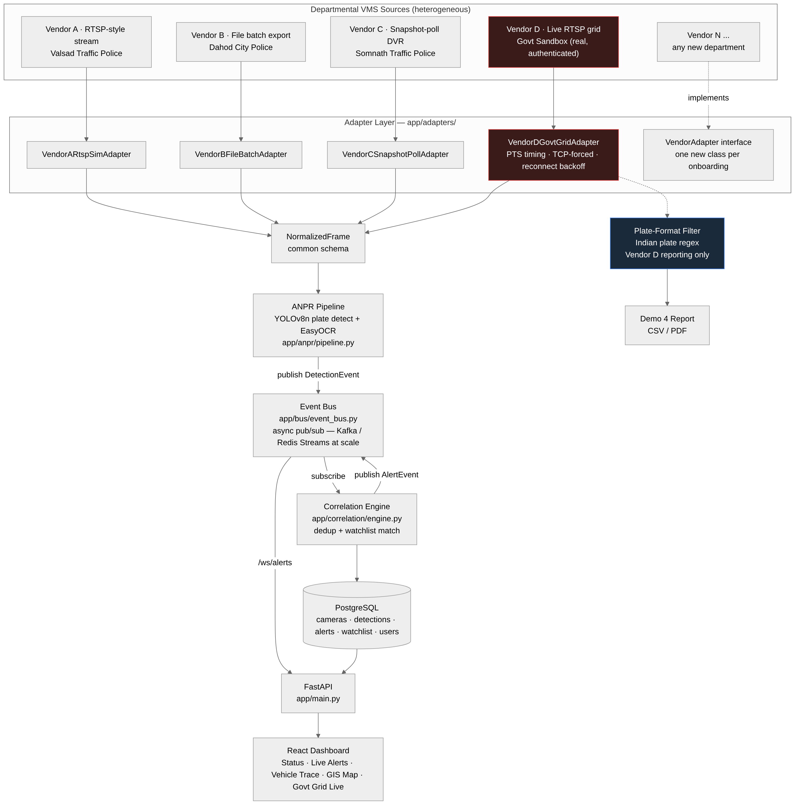
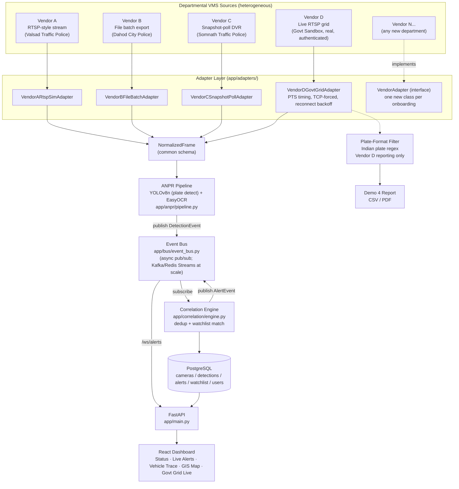

# Architecture

## High-level component diagram

Rendered image (source: `diagrams/architecture_full.mmd`, also available as
`.svg`): `diagrams/architecture_full.png`

A simplified one-slide overview version for presentations:
`diagrams/architecture_overview.png` (source: `diagrams/architecture_overview.mmd`)

Mermaid source (kept in sync with `diagrams/architecture_full.mmd` — edit
that file and re-render, don't edit this block in isolation):

## Component responsibilities

| Component | Responsibility | Does NOT do |
|---|---|---|
| Adapter | Translate one vendor's native ingestion mechanics + metadata into `NormalizedFrame`/`CameraInfo` | Run ANPR, know about the bus, know about other vendors |
| ANPR pipeline | Detect + OCR plates on a normalized frame | Know which vendor/department produced the frame, decide alerts |
| Event bus | Deliver published events to subscribers by topic | Interpret event contents |
| Correlation engine | Dedup detections, check watchlist, decide "sighting" vs "alert" | Touch vendor-specific data, run ANPR |
| API / dashboard | Expose state (cameras, alerts, trace) and control (login, run ingestion) | Talk directly to adapters or the ANPR pipeline |

The correlation engine is deliberately the *only* place a "this is a
match" decision is made — every other component only produces or
transports data.

## End-to-end data flow (as actually implemented and tested)

1. `app/ingestion/orchestrator.py::ingest_adapter()` iterates one
   adapter's `frames()` async generator.
2. Each `NormalizedFrame` (with a saved JPEG path) is passed to
   `app/anpr/pipeline.py::detect_and_read_plates()` — YOLOv8n locates
   plate regions on a 640px-downscaled copy, EasyOCR reads text from
   each crop at full resolution.
3. Each plate read becomes a `DetectionEvent`, published to the bus's
   `anpr.detections` topic.
4. `CorrelationEngine._consume()` (subscribed at app startup, before any
   detection can be published — see the race-condition note below)
   receives the event, writes a `DetectionRecord`, deduplicates against
   the same camera+plate within a 10-second window, and checks the
   watchlist table.
5. On a match, an `AlertRecord` is written and an `AlertEvent` is
   published to `watchlist.alerts`.
6. The FastAPI `/ws/alerts` WebSocket relays that event live to any
   connected dashboard; REST endpoints (`/api/alerts`, `/api/trace/*`)
   serve the same underlying Postgres data for polling/lookup.

## A real subscription race, and how it's handled

Python async generators don't execute their body — including
subscription registration — until first iterated. Scheduling a consumer
as `asyncio.create_task(bus.subscribe(topic))` therefore has a genuine
window where events published before the task's first loop iteration
are silently dropped. This was caught during Phase 3/4 end-to-end
testing (zero alerts landed despite detections firing) and fixed by
splitting subscription into a synchronous `subscribe_now()` (registers
the queue immediately, no await) called before scheduling the consumer
task, and an async `drain()` that only handles delivery. The correlation
engine's `start()` and the `/ws/alerts` endpoint both use this pattern.
Anyone adding a new bus consumer should use `subscribe_now()` +
`drain()`, not raw `create_task(subscribe())`, for the same reason.

## Demo-scale vs. production-scale substitutions

| Layer | Tonight (demo, ~5 cameras) | Statewide (~80,000 cameras) |
|---|---|---|
| Event bus | In-process `asyncio.Queue` pub/sub | Kafka or Redis Streams — same `publish()`/`subscribe()` contract, different backend. Needed once consumers run in separate processes/hosts, which an in-process bus cannot support. |
| Database | Single PostgreSQL instance | PostgreSQL with read replicas / partitioned detection tables by time+region, or a managed cloud Postgres with connection pooling (pgbouncer) |
| ANPR compute | CPU inference, sampled frames from recorded clips | GPU inference fleet (see `07-infrastructure-sizing.md`), real-time frame sampling per camera's actual FPS |
| Frame storage | Local disk under `data/frames/` | Object storage (S3-compatible) with lifecycle policies (see `08-network-bandwidth-storage.md`) |
| Deployment | Docker Compose, single host | Kubernetes, multi-zone (see `06-deployment-architecture.md`) |

This table exists so every "at scale, X becomes Y" claim in this doc set
maps to a concrete component that was actually built, not a diagram-only
promise.
