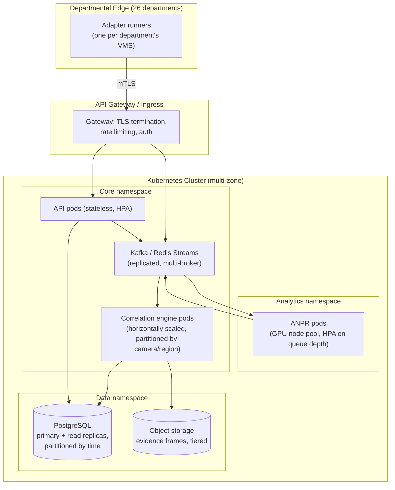

# Deployment Architecture

## Tonight: Docker Compose (single host)

`docker-compose.yml` at the repo root defines three services:

- `postgres` (official `postgres:16-alpine` image, persisted volume)
- `backend` (FastAPI + ANPR pipeline, built from `backend/Dockerfile`;
  installs `libgl1`/`libglib2.0-0`/`ffmpeg` which OpenCV needs at
  runtime even in the "headless" build)
- `frontend` (React app built and served via nginx, `frontend/Dockerfile`)

The backend container runs `init_db.py` → `seed_data.py` →
`seed_static_cameras.py` → `uvicorn` on startup, so `docker compose up
--build` is genuinely one command from clean state to a working demo —
see the root README for the honesty note on why this exact Compose file
could not be executed end-to-end on the dev machine (no Docker/root
access there) despite being written against verified, pinned dependency
versions.

This is the right shape for a single-site pilot deployment (e.g. one
department, or a state-level integration test environment) but is not
the target topology for 80,000 cameras statewide.

## Statewide: Kubernetes topology (designed, not built)

Key differences from tonight's Compose topology, and why each is
necessary at scale:

| Concern | Tonight | Statewide | Why the change is needed |
|---|---|---|---|
| Event bus | In-process asyncio queues | Kafka/Redis Streams, multi-broker | An in-process bus only works within one Python process; ANPR workers, correlation engine, and API must scale as independent replicas across many nodes. |
| ANPR compute | 1 CPU process | GPU node pool, horizontally autoscaled on queue depth | 80,000 cameras' worth of sampled-frame inference cannot run on CPU within any reasonable latency budget (see `07-infrastructure-sizing.md`). |
| Correlation engine | 1 in-process instance | Multiple replicas, partitioned (e.g. by camera region) | Single-instance correlation becomes a throughput bottleneck and a single point of failure at statewide event volume. |
| Database | 1 Postgres instance | Primary + read replicas, time-partitioned detection tables | Detection volume at 80,000 cameras is far beyond one instance's practical write/query throughput; see `07-infrastructure-sizing.md`. |
| Frame storage | Local disk | Tiered object storage (hot/warm/cold) | See `08-network-bandwidth-storage.md` for retention-tier reasoning. |
| Network | Plain HTTP, localhost | mTLS from department edge to gateway, service mesh mTLS internally | See `05-cybersecurity-architecture.md`. |

## Multi-zone / DR posture

At statewide scale the Kubernetes cluster should span at least two
availability zones (ideally two regions for the core database and
object storage, given this is law-enforcement-critical infrastructure).
See `12-disaster-recovery.md` for backup/failover specifics — this
document covers only the live-serving topology.

## Why Kubernetes and not "bigger Docker Compose"

Compose has no built-in horizontal autoscaling, no rolling
deployment/health-check-gated rollout, no multi-node scheduling, and no
native secrets rotation — all of which become necessary once ANPR
compute, correlation throughput, and API traffic each need to scale
independently across departments with very different camera counts
(a rural department with a handful of cameras vs. a major city's traffic
police with thousands). Kubernetes' per-workload HPA and node pools
(CPU pool for API/correlation, GPU pool for ANPR) map directly onto that
unevenness.
