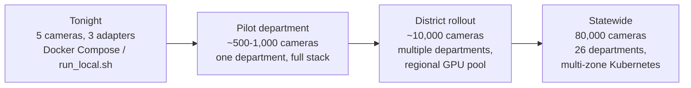

# Scalability & Future Roadmap

## Phasing: 5 demo cameras → 80,000 statewide

| Phase | Camera count (approx.) | What changes from the previous phase | Reference |
|---|---|---|---|
| **Tonight (proven)** | 5 (3 live feeds + 2 status-only) | N/A — this is the baseline | `README.md`, `02-architecture.md` |
| **Pilot department** | ~500–1,000 | Single department (e.g. one city Traffic Police or one Municipal Corporation) goes live end-to-end; validates the adapter pattern against a *real* vendor VMS (not simulated footage), real network conditions, and a first GPU node for ANPR instead of CPU. Event bus can likely still be a single Kafka/Redis Streams cluster, not yet needing the full multi-region topology. | `03-integration-strategy.md` onboarding procedure, `06-deployment-architecture.md` Kubernetes topology |
| **District rollout** | ~10,000 | Multiple departments across one or more districts onboard in parallel (RTO, District Police, Municipal Corporation, Excise check-posts per `10-department-wise-requirements.md`). Postgres moves from single-instance to partitioned/sharded (per `07-infrastructure-sizing.md`'s "when to shard" guidance — this is roughly the point where sustained write throughput starts approaching the 2,000–3,000/sec planning trigger). Correlation engine moves to multiple partitioned replicas. | `07-infrastructure-sizing.md` |
| **Statewide** | 80,000 | All 26 departments onboarded. Full multi-zone Kubernetes topology from `06-deployment-architecture.md` is live: GPU node pool autoscaled on queue depth, Kafka/Redis Streams multi-broker, Postgres primary + replicas + partitioning, tiered object storage. DR posture per `12-disaster-recovery.md` is active, not optional. | `06-deployment-architecture.md`, `12-disaster-recovery.md` |

Each phase transition is additive in the same sense onboarding one
department is additive (`03-integration-strategy.md`): new adapters, new
GPU/correlation-engine capacity, and — starting at the district-rollout
phase — a data-layer re-architecture (sharding) that is genuinely a
step change, not just "add more of the same," which is exactly why
`07-infrastructure-sizing.md` calls out that trigger point explicitly
rather than deferring it to "later."

## Future correlation-engine integrations

None of the following are live in this build. They require government
API access this hackathon submission does not have, and per the brief's
requirement to avoid placeholder/stub logic in anything actually
demoed, none of them are faked with mock responses either — they are
**absent**, described here only as designed future integration points,
exactly the same honesty posture the FRS roadmap section in
`04-ai-video-analytics.md` already takes for face recognition.

| Future integration | What it is | How it plugs into the existing architecture | What it would add |
|---|---|---|---|
| **VAHAN** (vehicle registration database) | Government of India's national vehicle registration database | A lookup service called from the correlation engine (or the trace API) after a plate match — same pattern as the watchlist check today: given a `plate_text`, query VAHAN for registered-owner name, vehicle class, registration status | Enriches a raw plate sighting with "whose vehicle is this and is it validly registered" — directly the RTO's core interest, per `10-department-wise-requirements.md` |
| **SARTHI** (driving license database) | Government of India's driving license database | Similarly a lookup keyed off a person identifier surfaced during an investigation workflow (not off the plate directly — this is a case-management-adjacent lookup, not a per-detection one) | License validity/holder verification during case follow-up, e.g. confirming whether a flagged driver's license is valid/suspended |
| **eGujCop** (Gujarat Police case management system) | The department's existing case/FIR management system | Bidirectional: an `AlertEvent` (watchlist match) could auto-create or link to an FIR/case record in eGujCop; conversely, a watchlist entry's `reason` field (already present in the schema — tonight's demo watchlist match cites `"Stolen Vehicle - FIR #GJ/DHD/2026/00417"`, `04-ai-video-analytics.md`) could be sourced live from eGujCop's FIR database instead of being seeded manually | Closes the loop from "system flags a match" to "case record updated," and keeps watchlist data synchronized with actual case status rather than a manually maintained table |
| **AFIS / NAFIS** (Automated/National Fingerprint Identification System, face recognition) | National biometric identification systems | Parallel analytics pipeline alongside ANPR, exactly as described in `04-ai-video-analytics.md`'s FRS roadmap section: a face-detection + embedding module subscribing to `frames.ingested` and publishing `FaceDetectionEvent`s to a new bus topic, correlated against an AFIS/NAFIS-backed face-embedding watchlist instead of (or alongside) the plate-based watchlist | Person-identification correlation to complement vehicle-identification correlation — see `04-ai-video-analytics.md` for the specific architectural note that this requires no redesign of the adapter/bus/correlation core, only a new analytics module and new event type |

**Why the architecture already supports these without redesign**: every
one of these is, structurally, "a new lookup or a new parallel analytics
module publishing to a new bus topic." The event bus and correlation
engine were built tonight specifically so that adding a new detection
*type* (face, not just plate) or a new *enrichment* (an external
database lookup after a match) doesn't touch the adapter layer, the
existing ANPR pipeline, or the existing plate-based correlation logic —
this is the same architectural property demonstrated concretely by
adding Vendor C after A and B with zero edits outside one new adapter
file (`03-integration-strategy.md`).

## Path to Model 5 (hybrid cloud-native SaaS)

`01-solution-overview.md`'s Model comparison table notes that Model 3's
bus/adapter pattern is "a clean on-ramp to Model 5 later, not a
competing path." Concretely: once the event bus is Kafka/Redis Streams
(not in-process) and the correlation engine is horizontally partitioned
(both already in the statewide design, `02-architecture.md`'s
demo-vs-production table), the same architecture can be offered as a
multi-tenant managed service to departments that want it, without
changing the adapter contract departments already integrate against.
That's a program/procurement decision for a later phase, not something
this submission presupposes.
