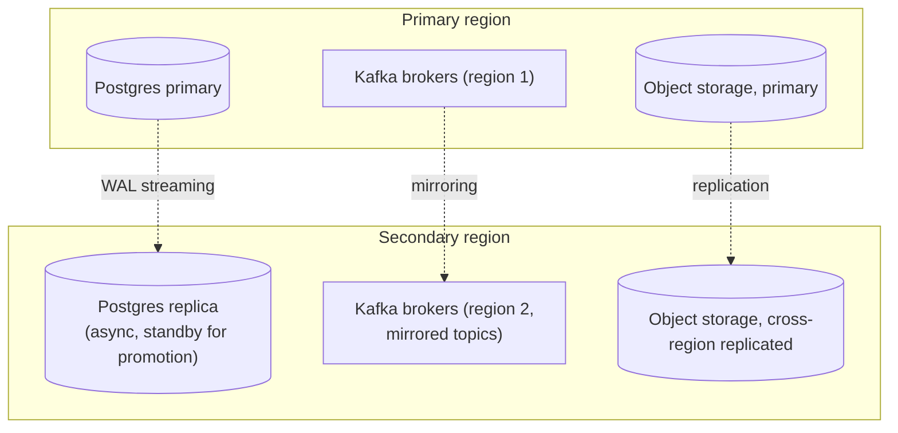

# Disaster Recovery — Designed for Production

Clearly split, matching the pattern established in
`05-cybersecurity-architecture.md` and `06-deployment-architecture.md`:
**tonight's actual build** (no HA, no DR — a single-instance demo) vs.
**designed for production**. Nothing in this document is implemented
tonight; it is the DR posture the statewide design targets.

## Tonight's actual posture (baseline, no DR)

| Component | Tonight | Implication |
|---|---|---|
| Postgres | Single instance (`postgres:16-alpine` in Docker Compose), one Docker volume, no replication, no automated backup | A container/volume loss loses all demo data — acceptable for a hackathon demo, not for production |
| Event bus | In-process `asyncio.Queue`, lives entirely in the backend process's memory | A backend process restart drops all in-flight (unpersisted) events — there's no bus durability at all tonight |
| Frame/evidence storage | Local disk (`data/frames/`), no replication | Single point of failure, no redundancy |
| Deployment | Single host, single Docker Compose stack | No failover target exists |

This table exists for the same reason the equivalent one exists in
`06-deployment-architecture.md` — every DR claim below should map back
to "this replaces that specific tonight-built component," not be a
free-floating promise.

## Postgres backup strategy (designed)

| Mechanism | Purpose | Design detail |
|---|---|---|
| **WAL archiving** | Continuous durability beyond the last full backup | Write-ahead logs shipped continuously to object storage as they're generated, not just periodic full dumps — this is what makes point-in-time recovery possible at all |
| **Point-in-time recovery (PITR)** | Recover to any point within the retention window, not just the last snapshot | Base backup (e.g. nightly) + continuously archived WAL segments allow replay to any timestamp — critical for a law-enforcement system where "restore to just before a bad write/corruption event" matters more than "restore to last night" |
| **Cross-region replica** | Survive a full regional outage (data center fire, extended power loss, regional network partition) | A standing physical or logical replica in a second region, kept in continuous sync (async replication is the realistic choice — synchronous cross-region replication adds write latency that a real-time alerting system generally shouldn't absorb) |
| **Backup verification** | A backup nobody has restored from is unverified | Periodic actual restore drills against the backup chain — not just confirming the backup job "succeeded," but confirming the restored database is queryable and complete |

This directly extends the sharded/partitioned Postgres design from
`07-infrastructure-sizing.md`: at statewide scale, backup/PITR/
replication apply per-shard, not to one monolithic instance — a detail
that matters operationally (a restore drill needs to cover every shard,
not just "Postgres" as a singular thing) but doesn't change the
mechanism.

## Event bus durability at scale (designed)

Tonight's in-process bus has zero durability by construction — it's a
Python-process-lifetime queue. The statewide design (Kafka or Redis
Streams, per `02-architecture.md`'s demo-vs-production table) changes
this fundamentally:

| Setting | Design choice | Why |
|---|---|---|
| Replication factor | **3** (standard Kafka production baseline) | Tolerates the loss of any one broker without losing unconsumed events; replication factor 2 tolerates only a single, non-overlapping failure window and is generally considered the minimum-viable-but-risky choice for anything carrying law-enforcement-relevant events |
| Minimum in-sync replicas | 2 (of 3) | A write is only acknowledged once at least 2 replicas have it — prevents acknowledging a write that only exists on a broker that's about to fail |
| Topic retention | Bus retention window distinct from — and shorter than — the Postgres/object-storage retention tiers in `08-network-bandwidth-storage.md` | The bus is a delivery mechanism, not the system of record; a few days of topic retention is enough to let a consumer catch up after an outage, not a substitute for the hot/warm/cold storage tiers, which are the actual durable record |

## What's recoverable vs. inherently lossy

Being explicit about this matters for a law-enforcement system —
overstating durability guarantees is worse than stating the real gap.

| Scenario | Recoverable? | Why |
|---|---|---|
| Postgres primary failure after a committed write | Yes — via replica promotion (near-zero data loss with sync-ish replication) or PITR restore from WAL (data loss bounded by WAL-shipping lag, typically seconds) | The write was durably committed and either replicated or WAL-archived before the failure |
| Event bus broker failure, event already replicated (≥ min in-sync replicas) | Yes | By definition of the min-in-sync-replicas setting above |
| **A detection event generated by the ANPR pipeline but not yet published to the bus** (e.g. backend process crashes mid-pipeline, between frame processing and `publish()`) | **No — inherently lossy** | The event never existed outside process memory at that instant; there's nothing to replicate or replay. This is a real, honest gap: a single missed detection on one sampled frame of one camera is a low-stakes loss (the same vehicle is very likely caught by an adjacent sample or an adjacent camera, given the trace pattern relies on multiple sightings, not a single one), but it should be named rather than implied away. |
| **An event published to the bus but not yet consumed/persisted by the correlation engine at the moment of a correlation-engine crash** | Depends on bus replication + consumer offset commit semantics | If the bus already durably has the event (replicated) and the consumer had not yet committed its offset, replay on restart recovers it — this is exactly why moving off the in-process bus matters for DR, not just for horizontal scaling |
| Object storage (evidence crops, cold tier) loss | Yes, at the tier's configured durability level (e.g. standard object storage durability figures, further protected by cross-region replication per the multi-zone posture below) | Object storage tiers are designed with high built-in durability independent of the application layer |

## RTO / RPO targets (reasoning, not a committed SLA)

**Assumption D1**: this is a law-enforcement-relevant but not
life-safety-critical real-time system (unlike, say, emergency dispatch)
— alerts matter within minutes, not milliseconds, and a short recovery
window is acceptable if it's honestly bounded.

| Target | Reasoning |
|---|---|
| **RPO (Recovery Point Objective) ≈ seconds to low minutes** for the Postgres/event layer | Bounded by WAL-shipping lag (seconds) and bus replication lag (sub-second to seconds) under normal conditions — the "inherently lossy" gap above (an in-flight, unpublished event) is not bounded by any RPO target because it was never durably recorded in the first place; RPO targets only apply to what the system had already committed |
| **RTO (Recovery Time Objective) ≈ minutes to low tens of minutes** for a single-zone failure (automated failover to a replica/standby) | Consistent with standard managed-Postgres and Kubernetes-native failover timings — this is an automated-failover number, not a "engineer wakes up and manually intervenes" number |
| **RTO ≈ hours** for a full regional failure requiring cross-region promotion | Cross-region failover is a higher-stakes, usually partially manual decision (avoiding an unnecessary "split-brain" promotion is more important than shaving minutes off this path) — a state-critical system should bias toward correctness of failover decision over speed here |

These are reasoning-based planning targets, not a committed SLA — a real
SLA would be set jointly with whoever operationally owns the SOC/
monitoring function (`09-cost-benefit-analysis.md`'s staffing line) and
validated against actual failover drills, not derived from first
principles alone.

## Multi-region failover posture

Extends the multi-zone Kubernetes topology from
`06-deployment-architecture.md` ("at statewide scale the Kubernetes
cluster should span at least two availability zones, ideally two regions
for the core database and object storage"):

- **Within a region**: multi-zone Kubernetes node pools (as in
  `06-deployment-architecture.md`) handle a single-zone outage
  transparently via standard k8s scheduling + Postgres read-replica
  promotion within-region — this is the "minutes to low tens of
  minutes" RTO case above.
- **Across regions**: a secondary region holds an async-replicated
  Postgres standby, mirrored Kafka topics, and cross-region-replicated
  object storage — promoted only on a full primary-region loss, which is
  the "hours" RTO case, deliberately biased toward a correct (not
  fastest-possible) failover decision given the sensitivity of the data
  involved.
- **What doesn't need cross-region duplication**: department-side
  adapters and each department's own local VMS/video storage are
  unaffected by a core-layer regional failover, since raw video was
  never centralized in the first place (`08-network-bandwidth-storage.md`)
  — a core-layer outage degrades statewide correlation/alerting, not
  each department's own local camera operations, which is a meaningful
  resilience property of the federation design itself, not just of the
  DR plan layered on top of it.
